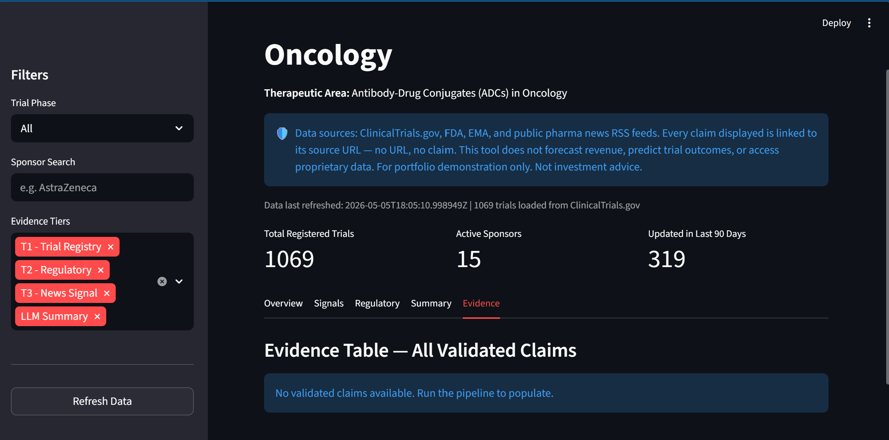

# Pharmaceutical Strategic Intelligence Tool (PSIT)

> Public-data pharmaceutical intelligence for ADC oncology pipeline analysis.
> Every claim is sourced and linked. No URL, no claim.



---

## What It Does

PSIT is a Streamlit dashboard that aggregates, validates, and presents clinical trial intelligence for antibody-drug conjugate oncology programs — drawing on ClinicalTrials.gov trial registrations, FDA and EMA regulatory actions, and pharma news RSS feeds to surface pipeline density, velocity, and differentiation signals in a single interface. All data is public, all analysis is reproducible, and no proprietary databases, licensed data feeds, or internal clinical records are accessed at any point.

---

## Architecture: Three-Tier Evidence Model

The pipeline mirrors the evidence hierarchy used in pharmaceutical due diligence: structured registry data as the primary layer, regulatory actions as a confirmatory layer, and news signals as early-warning context. Each layer feeds a shared validation pipeline before anything reaches the user interface.

```
Tier 1 ── Structured    ClinicalTrials.gov API v2
Tier 2 ── Regulatory    FDA Drug Approvals / EMA EPAR
Tier 3 ── News Signal   Endpoints News / STAT News RSS
                │
                ▼
    ┌───────────────────────────┐
    │      ClaimObject Schema   │  claim_text, source_url, source_name,
    │                           │  evidence_type, pull_timestamp, nct_id
    └───────────┬───────────────┘
                │
                ▼
    ┌───────────────────────────┐
    │      validate_claim()     │  rejects: missing URL
    │                           │           non-whitelisted domain
    └───────────┬───────────────┘
                │
                ▼
    ┌───────────────────────────┐
    │       SQLite Cache        │  trials │ regulatory_signals
    │                           │  news_signals │ validated_claims
    └───────────┬───────────────┘
                │
                ▼
    ┌───────────────────────────┐
    │       Streamlit UI        │  Overview │ Signals │ Regulatory
    │                           │  Summary  │ Evidence
    └───────────────────────────┘
```

What this diagram describes is not just a data pipeline but an integrity contract: a claim from any tier must pass through the same schema enforcement and domain whitelist before it is written to the cache or rendered in the UI. Tier 1 structured records, Tier 2 regulatory signals, and Tier 3 news items are treated as peers in terms of validation requirements, even though they carry different evidential weight — and the UI reflects that distinction through explicit tier labelling rather than by mixing claims into an undifferentiated feed.

---

## The No-URL-No-Claim Principle

Every claim object in PSIT must carry a non-empty `source_url` pointing to a whitelisted public domain — clinicaltrials.gov, fda.gov, ema.europa.eu, or a handful of approved news sources — or it is rejected before it reaches the database. This is not a display convention or a prompt instruction: `validate_claim()` enforces it at the application layer, meaning that even if an LLM summary step produces a plausible-sounding claim without a traceable source, that claim cannot pass into the SQLite cache and cannot appear in the Evidence tab. The constraint is tested directly by the integration test suite, which verifies that claims from all three evidence tiers pass validation when correctly sourced and that claims with missing URLs or unrecognised domains are rejected with the correct error message — giving a technical reviewer a concrete, runnable proof of the design's reliability rather than just an assertion about it.

---

## Getting Started

**Prerequisites:** Python 3.10+, git

```bash
# 1. Clone and install
git clone https://github.com/YOUR_USERNAME/psit.git
cd psit
python -m venv .venv

# Windows
.venv\Scripts\activate
# macOS / Linux
source .venv/bin/activate

pip install -r requirements.txt

# 2. Configure API key
# Copy the secrets template and add your Anthropic key
copy .streamlit\secrets.toml .streamlit\secrets_local.toml
# Edit secrets_local.toml: set ANTHROPIC_API_KEY = "sk-ant-..."

# 3. Run
streamlit run app.py
```

Open [http://localhost:8501](http://localhost:8501) in your browser. On first run with an empty database, the app will prompt you to execute the data pipeline — follow the on-screen instructions to populate the SQLite cache from the public data sources.

---

## Test Suite

```bash
pytest tests/ -v --tb=short
# Expected: 17 passed, 0 failed
```

| File | Tests | Covers |
|---|---|---|
| `tests/test_claim_validation.py` | 12 | ClaimObject schema enforcement, source whitelist, ValidationError messages |
| `tests/test_integration.py` | 5 | End-to-end: valid claims from all three tiers pass; invalid domain rejected; missing URL rejected |

The test suite proves two things about the reliability architecture. First, that the validation layer is not a best-effort check — every path through `validate_claim()` that should reject a claim does so with the correct error message, including lookalike domains designed to defeat naive substring matching. Second, that the evidence tier pipeline is end-to-end consistent: a correctly formed claim from ClinicalTrials.gov, FDA, and a news RSS feed each passes validation independently, confirming that no tier is accidentally excluded by a whitelist or schema mismatch.

---

## Portfolio Notes

### Three-Tier Evidence Model

The architecture of PSIT reflects how evidence is actually weighted in pharmaceutical due diligence, not how it is most conveniently available from an API. In any rigorous pipeline assessment — whether conducted for a licensing deal, a co-development discussion, or a competitive landscape brief — the analyst begins with structured registry data because it is prospectively registered, regulatory-grade, and unmediated by editorial judgment. Regulatory actions (FDA approvals, complete response letters, EMA opinions) then serve as confirmatory signals: they represent a formal institutional verdict on the data the sponsor presented, which is a different evidentiary category from the trial registration itself. News and analyst commentary comes last, treated as early signal rather than established fact — valuable for identifying emerging narratives before they appear in formal filings, but too editorially variable to anchor a claim. PSIT implements this exact hierarchy as three distinct evidence tiers, each labelled explicitly in the UI, so that a reviewer can instantly distinguish a Phase 3 enrollment figure from ClinicalTrials.gov from a headline summarising a conference presentation. The design respects the cognitive model that experienced analysts already use, rather than flattening all sources into a single feed that obscures provenance.

### The No-URL-No-Claim Rule

The no-URL-no-claim rule is drawn directly from systematic review methodology, where every included study must be traceable to a primary source record — a PMID, a DOI, a trial registry identifier — before it can contribute to a finding. The analogy is precise: a claim without a source URL is, by the standards of evidence-based practice, not a claim at all. What distinguishes PSIT's implementation from a documentation guideline or a prompt instruction is where enforcement happens. Telling a language model to "include source links" produces links when it can find them and plausible-sounding references when it cannot — a pattern well-documented in LLM evaluation literature. Enforcing the constraint at the application layer, inside `validate_claim()`, makes it an architectural invariant: a claim with no URL or an unrecognised domain cannot be written to the SQLite cache and cannot appear in the Evidence tab regardless of what the model produced. The difference between a guideline and an invariant is the difference between a review process that sometimes catches errors and a system that structurally cannot produce a certain class of error.

### LLM as Summarizer, Not Analyst

The strategic risk of deploying large language models in pharmaceutical intelligence is not that they perform poorly on language tasks — it is that they perform well enough to produce confident-sounding inferences from incomplete or ambiguous data, and in a domain where a misattributed endpoint or an incorrect approval date carries real consequences, confident-sounding is not the same as correct. PSIT addresses this by constraining Claude Haiku to a single role: summarising validated, structured facts that have already been fetched, schema-validated, source-checked, and written to the database. The model does not retrieve data, does not assess evidence quality, and does not draw conclusions about trial outcomes — those tasks belong to the deterministic pipeline stages that precede it. What the model does — converting a structured dataset into coherent prose that a non-technical stakeholder can read in ninety seconds — is a genuine efficiency gain that does not require inference from uncertain premises. The constraint is not a limitation on the AI's capabilities; it is a deliberate scope boundary that keeps the efficiency benefit while removing the hallucination risk that arises when models are asked to do more than their training reliably supports.

### Public Data Only

The decision to build PSIT entirely on public data sources — ClinicalTrials.gov, FDA.gov, EMA.europa.eu, and public RSS feeds — is a deliberate scope decision with a strategic rationale, not a technical constraint imposed by access limitations. A pharmaceutical intelligence tool that depends on licensed data feeds, proprietary databases, or authenticated internal systems can be used internally and evaluated by people with the same access, but it cannot be demonstrated to a prospective employer, shared with a collaborator at another organisation, independently verified by a peer, or deployed to a cloud environment without a procurement process. Public data as the sole input means that every aspect of the pipeline — the data fetching logic, the validation layer, the claim store, the UI — is auditable by anyone with internet access and a Python environment. That auditability is itself a feature for a portfolio context: rather than asserting that the system works as described, the repository allows a reviewer to clone it, run it against live data, and verify the claims in the README against the output on their own screen. In a domain where analytical rigour is a core professional credential, a tool that can be independently verified is more useful as a portfolio artifact than one that requires taking the developer's word for it.

---

*Built by [Your Name] as part of an AI/data portfolio for life sciences strategy.*
*Stack: Python 3.11, Streamlit, Anthropic Claude Haiku, SQLite, feedparser.*
*Data sources: ClinicalTrials.gov API v2, FDA.gov, EMA.europa.eu, public RSS.*
